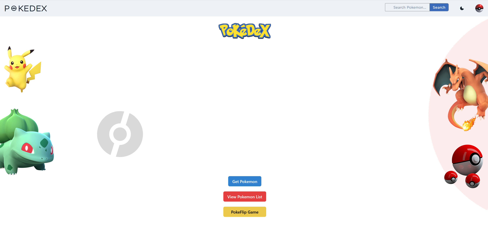
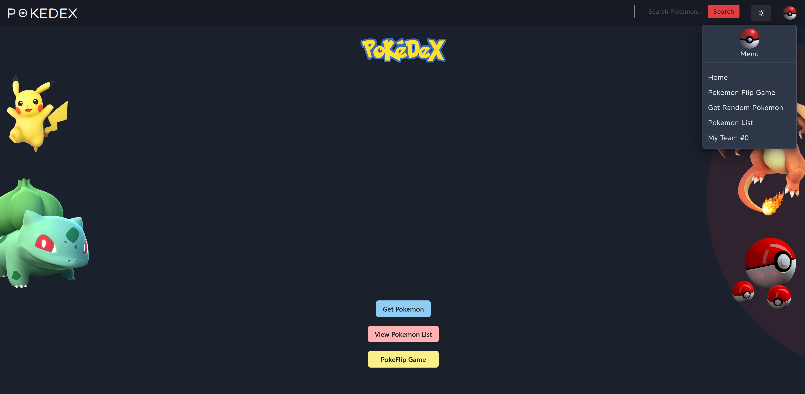
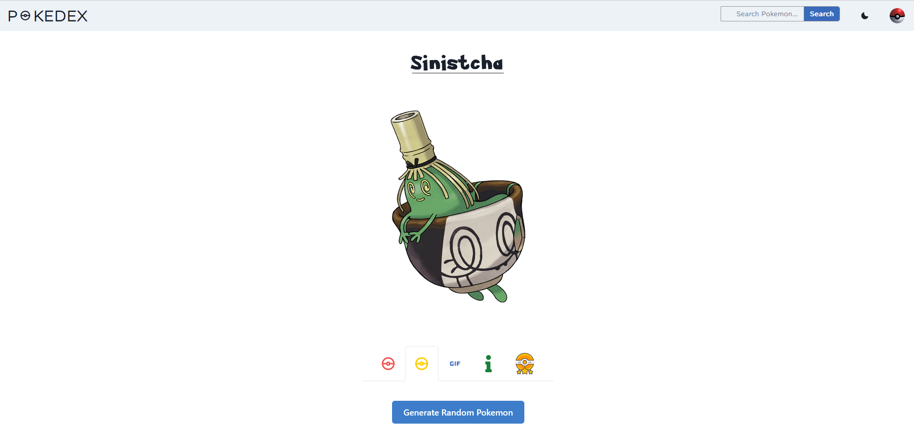
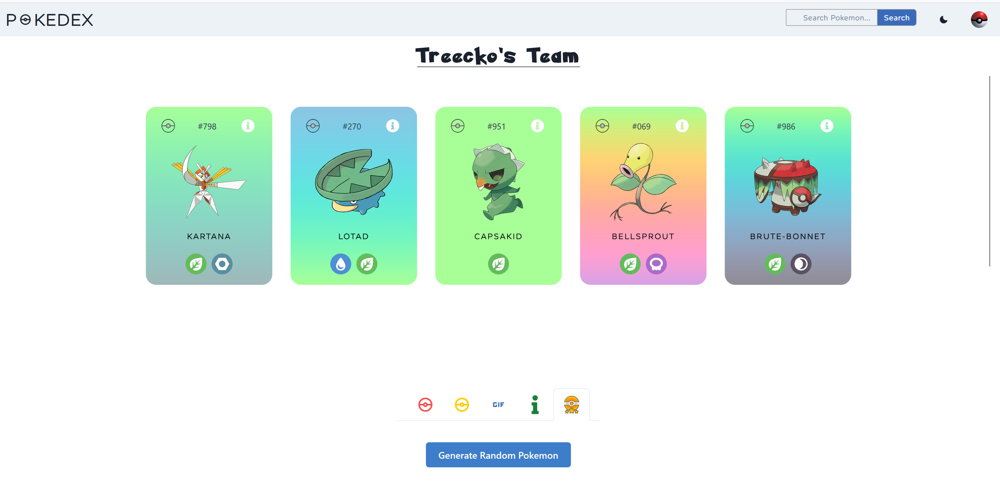
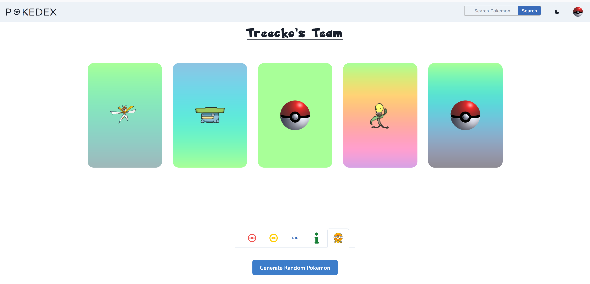
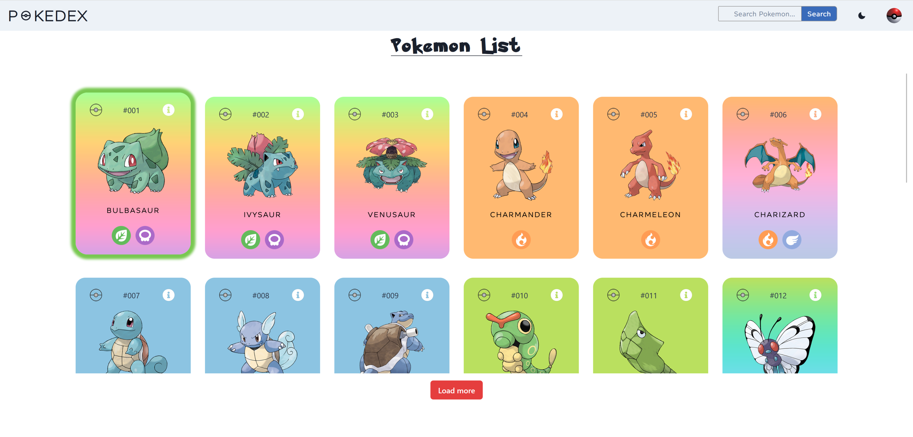
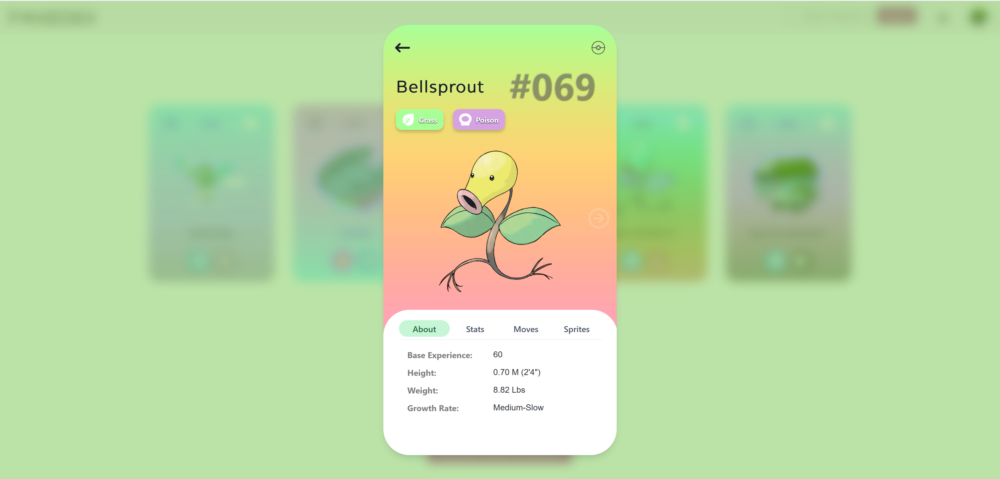
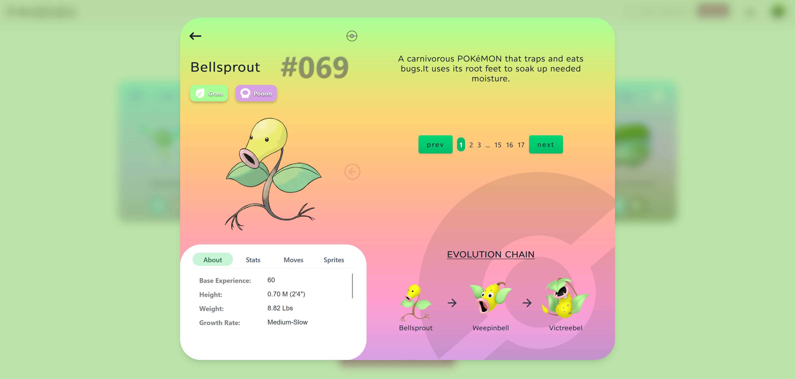

# Pokedex WebApp

Welcome to the **Pokedex WebApp** — a React-based web app for Pokemon
enthusiasts! This app lets you explore Pokemon, generate random ones, view
randomly generated Pokemon teams, and play an interactive pokeflip memory game.

## 🌐 Live Demo

Check out the live version of the app
[here](https://mikhail-w.github.io/pokedex/#/).

<p align="center"style="margin-top: 30px;">
  
</p>

## 🚀 Features

### 🎮 Interactive Home Page

- View dynamic Pokemon images and navigate to different sections.
- Buttons for generating random Pokemon, viewing the Pokemon list, or playing
  the PokeFlip game.
- Toggle between light and dark mode.
- View the team of Pokemon you've caught.

### 📖 Pokemon List

- Displays a paginated list of all Pokemon.
- Filtered search functionality for finding specific Pokemon.

### 🔄 Generate Random Pokemon

- Discover random Pokemon with a single click.
- View their stats, moves, abilities, and evolution chain.

### 🧩 Team Builder

- Whenever you generate a new Pokemon a random team is created for you based on
  the Pokemon type.

### 🎲 PokeFlip Game

- Play a memory game with Pokemon cards.
- Test your memory and match the Pokemon pairs!

## 💻 Tech Stack

- **React** - Component-based architecture.
- **Vite** - Fast and modern development build tool.
- **CSS** - Custom styling for a visually appealing UI.
- **React-Router** - For seamless page navigation.
- **Pokemon API** - Fetches real-time Pokemon data.

## 🖼 Screenshots

### Home Page



### Dark Mode



### Random Pokemon Generator



### Pokemon Card Front



### Pokemon Card Back



### Pokemon List



### Pokemon Card Info



### Pokemon Card Info Expanded



### PokeFLip Game

## 

## 🛠 Installation and Setup

Follow these steps to get the app up and running:

1. **Clone the Repository**
   ```bash
   git clone https://github.com/mikhail-w/pokedex.git
   cd pokedex
   ```
2. **Install Dependencies**
   ```bash
   npm install
   ```
3. **Run the App**
   ```bash
   npm run dev
   ```
4. **View in Browser**
   ```bash
   http://localhost:5173
   ```
